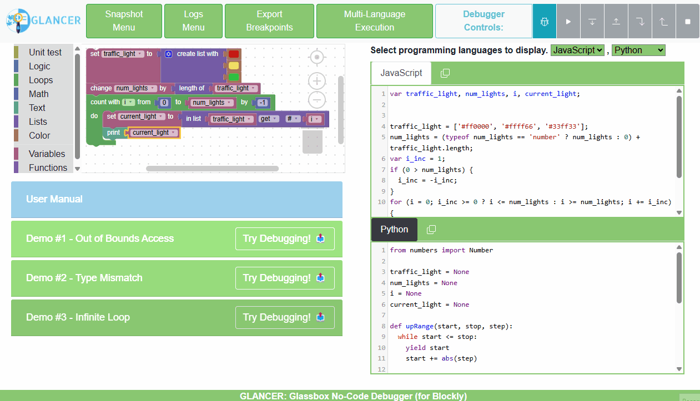

# GLANCED - Glassbox-Code No-Code Enhanced Debugger for Blockly
## **Abstract**
**GLANCED** extends Blockly by introducing a **Glassbox** debugging approach, bridging the gap between visual programming and generated source code. Unlike traditional debuggers that operate solely in the visual or textual layer, GlaNCED enables synchronized debugging between the No-Code workspace and multiple programming languages.

## **Demo**
Use the app online at https://blockly-glassbox-debugger.onrender.com/

## **Key Features**  
- **Glassbox Code View** – Displays the Blockly workspace alongside **real-time generated code** in multiple target programming languages (e.g., JavaScript and Python).  
- **Breakpoint Synchronization** – Set **breakpoints*** on any block or source-line-of-code, synchronizing view and execution control flow between them.
- **Highlight Synchronization** – Breakpoints set in Blockly **automatically sync** to corresponding source-line-of-code (SLOC) and vice versa.  
- **Snapshot Mechanism** – Save and load Blockly programs with set breakpoints.
- **Execution History & Logs** – Logs program execution results and snapshots automatically.  
- **Multi-Language Glassbox Debugging** – Supports debugging in multiple **programming languages simultaneously**, allowing control flow and debugging consistency across platforms.  
- **Multi-Langauge Breakpoint Export** – Enables exporting currently set breakpoints on any target programming language, to be imported in the VS Code IDE using an extention.  
- **Multi-Langauge Execution** - Execute the program in multiple programming languages simultaneously and view a comparison table of their results (The debugger is running JavaScript).

## **Comparison with [BVD4B](https://github.com/krystalsavv/Complete-Block-Level-Visual-Debugger-for-Blockly) and [NuzzleBug](https://github.com/se2p/NuzzleBug)**
Our platform extends the features of BVD4B by introducing Glassbox multi-language debugging. The following table compares the features of GlaNCED and BVD4B and NuzzleBug:
| Feature                  | **GlaNCED** | **BVD4B** | **NuzzleBug** |
|--------------------------|------------|--------------|----------|
| Visual Breakpoints per block |✅|✅|✅|
| Block-level step-execution |✅|✅|✅|
| Variable Inspection |✅|✅|✅|
| Debug Questions (WhyLine) |❌|❌|✅|
| Multi-Language Code Display |✅|❌|❌|
| Multi-Language Highlight |✅|❌|❌|
| Multi-Language Debugging |✅|❌|❌|
| Multi-Language Execution |✅|❌|❌|
| Snapshot & History Logging |✅|❌|❌|
| Breakpoint Export to IDE |✅|❌|❌|

## User Guide
1. **Blockly Workspace** - Create a program using Blockly blocks.
2. **Code View** - View the generated code in multiple programming languages, select two target langauges to display using the selection menu.
3. **Breakpoints** - Set breakpoints on blocks or source code lines.
   - Set or update breakpoints on Blockly blocks by opening the context menu using right mouse click and selecting "Add/Remove/Disable Breakpoint".
   - Set or update breakpoints on generated code by left clicking on the line number in the code view.  
4. **Highlight Syncing** - Highlights set in Blockly automatically sync to corresponding source-line-of-code (SLOC) and vice versa.
   - Highlight Blockly blocks by opening the context menu using right mouse click and selecting "Highlight Block & Code".
   - Set or remove code highlight by clicking the middle mouse button on the line number in the code view.  
5. **Snapshot Mechanism** - Save and load Blockly programs with set breakpoints using the snapshot menu. An automatic snapshot is taken when the program is executed.
6. **Breakpoint Export to IDE** - Export breakpoints to the VS Code extention, BreakpointIO, by clicking on the "Export Breakpoints" button, selecting target programming lanauge and pressing the download button which will download ``breakpoints.json``.

## Technologies Used
- [Blockly](https://developers.google.com/blockly)
- [BVD4B](https://github.com/krystalsavv/Complete-Block-Level-Visual-Debugger-for-Blockly) 
- [CodeMirror](https://codemirror.net/)
- [Express](https://expressjs.com/)
- [Bootstrap](http://getbootstrap.com)
- [jQuery](https://jquery.com)
- [Handsontable](https://handsontable.com)
- [BreakpointIO](https://marketplace.visualstudio.com/items?itemName=deckerio.breakpointio)

## **Run Project Locally**
### **Prerequisites**
- Node version 16.
- Node package manager (npm) version 8.
### **Install and Build**
- Run ``npm install``.
- Run ``npm run build``.
### **Start Local Development Server**
- Run ``npm start``.
- Open ``http://localhost:3000/`` in your browser.

## **License**
This project is licensed under the MIT License - see the [LICENSE](LICENSE) file for details.
